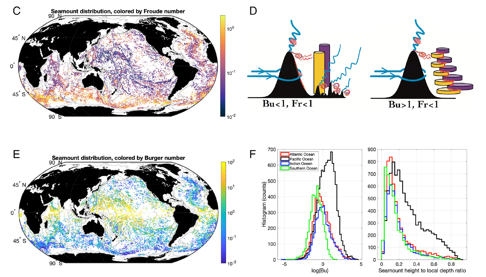

# LES study of roughness in seamounts

We focus on ACC seamounts, according to data from [Mashayek et al.
(2021)](https://www.pnas.org/doi/suppl/10.1073/pnas.2322163121):

i.e. seamounts with a relatively high Froude number and relatively low
Rossby number, in fast waters.