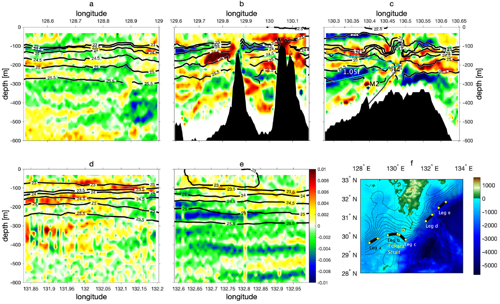

# LES comparison with the Tokara strait

Seamount data based on the Figure 1 of [Nagai et al.
(2021)](https://doi.org/10.1038/s43247-021-00230-7):

- Lz ≈ 600 m
- H ≈ 400 m maybe 500 m
- FWMH ≈ 10km to 15km (Full width at half-maximum)
- L = FWMH / (2√log(2)) = 6km to 9km
- α = H / FWMH ≈ 0.05 to 0.08
- V∞ ≈ 1 m/s
- f = 7.3e-5 1/s

Roₕ = V∞ / f FWMH ≈ 1.4 to 0.9

The stratification N²∞ seems to be variable, with low stratification below z = -300 m, and strong
stratification above that. For the strong stratification region at the top:

Δσ ≈ (24 - 23) kg/m³
Δz ≈ 50 m
∂ρ/∂z ≈ 0.02 kg / m⁴
N²∞ = - g (∂ρ/∂z) / ρ₀ ≈ 1e-4 1/s²

Frₕ = V∞ / N H ≈ 0.25
Sₕ  = Roₕ / Frₕ ≈ 6.84

For the weakly stratified reason,

Δσ ≈ (26 - 25.5) kg/m³
Δz ≈ 300 m
∂ρ/∂z ≈ 0.00167 kg / m⁴
N² = - g (∂ρ/∂z) / ρ₀ ≈ 1.5e-5 1/s²

With these data (and using the lower value for stratification):

Frₕ = V∞ / N H ≈ 0.64
Sₕ  = Roₕ / Frₕ ≈ 2.67
